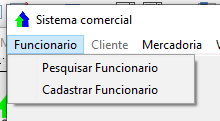

# Janela princial

A janela inicial é exibida apos o login do usuario

<figure><figcaption></figcaption></figure>

Na parte superior você encontra o menu, onde se encontram a grande marioria das funcionalidades do sistema. Para facilitar separamos em categorias são elas:

* Funcionarios
* Clientes (Indiponivel)
* Mescadorias (Indisponivel)
* Vendas (Indisponivel)
* Financeiro(indisponivel)
* Contabil(indisponivel)
* Ajuda(indisponivel)

### Funcionarios

<figure><figcaption></figcaption></figure>

Neste grupo você pode cadastrar e editar os funcionarios.

### Barra de favoritos

<figure><figcaption></figcaption></figure>

Em virtude da nescesidade de tornar mais rapido o acesso do operador na parte inferior, temos a barra de favoritos.

No momento esta um pouco limitada, mas traremos novas funcionalidades nas proximas atualizações

### Barra de status

Logo a baixo da barra de favoritos. Nela você pode ver o codigo interno e o nome do usuario logado.

<figure><figcaption></figcaption></figure>
